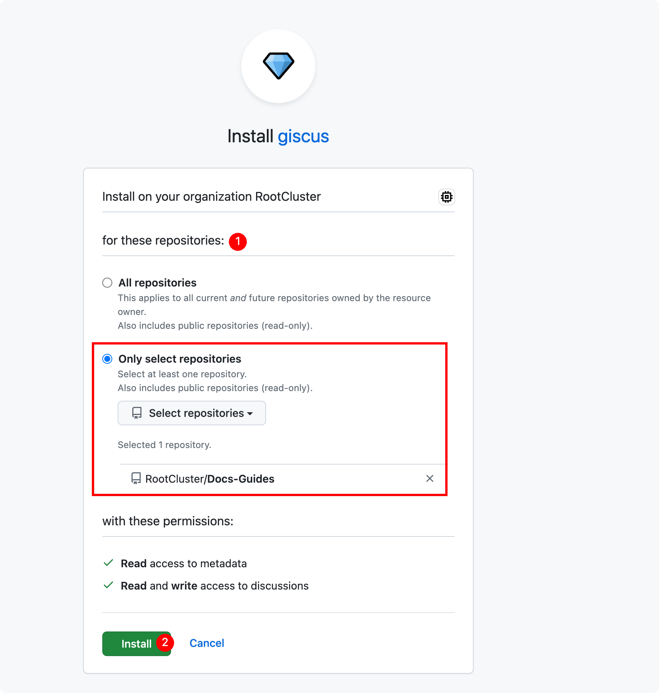
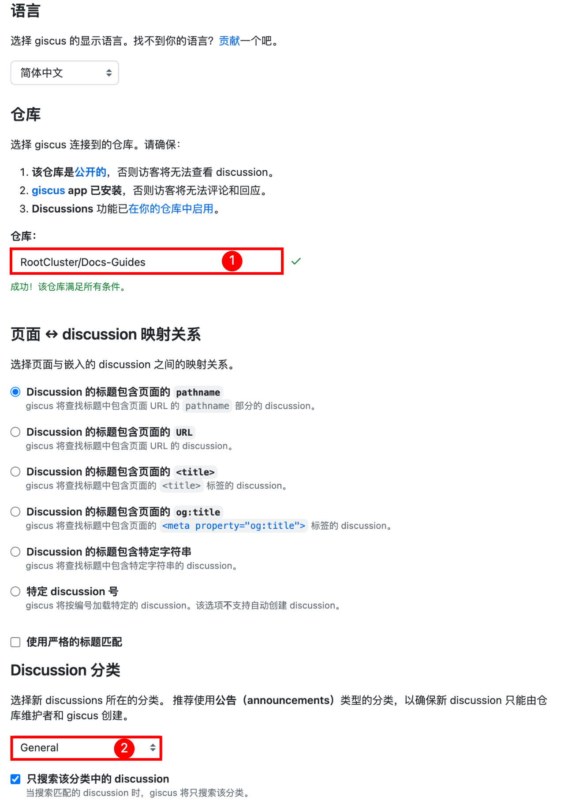

## Add dependencies

```bash npm2yarn
npm install --save @giscus/react
```

## Create comment compose

```ts title="src/components/Comment.tsx"
import React from 'react'
import { useThemeConfig, useColorMode } from '@docusaurus/theme-common'
import Giscus, { GiscusProps } from '@giscus/react'
import { useLocation } from '@docusaurus/router';

const defaultConfig: Partial<GiscusProps> = {
  id: 'comments',
  mapping: 'specific',
  reactionsEnabled: '1',
  emitMetadata: '0',
  inputPosition: 'top',
  loading: 'lazy',
  // 用根据路径标题自动生成的 sha1 值，精确匹配 github discussion，避免路径重叠（比如父和子路径）时评论加载串了
  strict: '1',
  lang: 'zh-CN',
}

export default function Comment(): JSX.Element {
  const themeConfig = useThemeConfig()

  // merge default config
  const giscus = { ...defaultConfig, ...themeConfig.giscus }

  if (!giscus.repo || !giscus.repoId || !giscus.categoryId) {
    throw new Error(
      'You must provide `repo`, `repoId`, and `categoryId` to `themeConfig.giscus`.',
    )
  }

  const path = useLocation().pathname.replace(/^\/|\/$/g, '');
  const firstSlashIndex = path.indexOf('/');
  var subPath: string = ""
  if (firstSlashIndex !== -1) {
    subPath = path.substring(firstSlashIndex + 1)
  } else {
    subPath = "index"
  }

  giscus.term = subPath
  giscus.theme =
    useColorMode().colorMode === 'dark' ? 'transparent_dark' : 'light'

  return (
    <Giscus {...giscus} />
  )
}
```

## Comment component loading method

In order to open comments configurable, you need to use [Swizzling](https://docusaurus.io/docs/swizzling) to adjust the page structure and embed the comment function into the page. Here is an explanation of how comments are loaded:

- Hide comments: Fully customize the page through `eject` to get the metadata of the page to determine whether it is necessary to hide comments.
- Enable comments: make light modifications to the page through `wrap`

In order to achieve the purpose of opening/hiding, it is necessary to modify the page components of docs, which are somewhat invasive, but eject is more invasive than wrap. When upgrading docusaurus, eject is more prone to compatibility problems, so this article uses the implementation of wrap to modify the page component.

### Enable comments

#### docs enable comments

1. swizzle `DocItem`

   ```bash npm2yarn
   npm run swizzle @docusaurus/theme-classic DocItem/Layout -- --wrap --typescript
   ```

2. Modify the following automatically generated source code files

   ```ts title="src/theme/DocItem/Layout/index.tsx"
    import React from 'react';
    import Layout from '@theme-original/DocItem/Layout';
    import type LayoutType from '@theme/DocItem/Layout';
    import type { WrapperProps } from '@docusaurus/types';
    // highlight-next-line
    import Comment from '@site/src/components/Comment';

    type Props = WrapperProps<typeof LayoutType>;

    export default function LayoutWrapper(props: Props): JSX.Element {
      return (
        <>
          <Layout {...props} />
          // highlight-next-line
          <Comment />
        </>
      );
    }
   ```

#### docs category enable comments

Here in the docs directory page will be automatically generated directory page, is made up of docusaurus ` DocCategoryGeneratedIndexPage ` rendering

1. swizzle `DocGategoryGeneratedIndexPage`

   ```bash npm2yarn
   npm run swizzle @docusaurus/theme-classic DocCategoryGeneratedIndexPage -- --wrap --typescript
   ```

2. Modify the following automatically generated source code files

   ```ts title="src/theme/DocCategoryGeneratedIndexPage/index.tsx"
    import React from 'react';
    import DocCategoryGeneratedIndexPage from '@theme-original/DocCategoryGeneratedIndexPage';
    import type DocCategoryGeneratedIndexPageType from '@theme/DocCategoryGeneratedIndexPage';
    import type { WrapperProps } from '@docusaurus/types';
    // highlight-next-line
    import Comment from '@site/src/components/Comment';

    type Props = WrapperProps<typeof DocCategoryGeneratedIndexPageType>;

    export default function DocCategoryGeneratedIndexPageWrapper(props: Props): JSX.Element {
      return (
        <>
          <DocCategoryGeneratedIndexPage {...props} />
          // highlight-next-line
          <Comment />
        </>
      );
    }
   ```

### Hide comments

#### docs hide comments

1. swizzle `DocItem`

   ```bash npm2yarn
   npm run swizzle @docusaurus/theme-classic DocItem/Layout -- --eject --typescript
   ```

2. <details>
    <summary>Modify the generated source code file.: <code>src/theme/DocItem/Layout/index.tsx</code></summary>

    ```ts title="src/theme/DocItem/Layout/index.tsx"
      import React from 'react';
      import clsx from 'clsx';
      import { useWindowSize } from '@docusaurus/theme-common';
      import { useDoc } from '@docusaurus/theme-common/internal';
      import DocItemPaginator from '@theme/DocItem/Paginator';
      import DocVersionBanner from '@theme/DocVersionBanner';
      import DocVersionBadge from '@theme/DocVersionBadge';
      import DocItemFooter from '@theme/DocItem/Footer';
      import DocItemTOCMobile from '@theme/DocItem/TOC/Mobile';
      import DocItemTOCDesktop from '@theme/DocItem/TOC/Desktop';
      import DocItemContent from '@theme/DocItem/Content';
      import DocBreadcrumbs from '@theme/DocBreadcrumbs';
      import Unlisted from '@theme/Unlisted';
      import type { Props } from '@theme/DocItem/Layout';

      import styles from './styles.module.css';
      // highlight-next-line
      import Comment from '../../../components/Comment';

      /**
      * Decide if the toc should be rendered, on mobile or desktop viewports
      */
      function useDocTOC() {
        const { frontMatter, toc } = useDoc();
        const windowSize = useWindowSize();

        const hidden = frontMatter.hide_table_of_contents;
        const canRender = !hidden && toc.length > 0;

        const mobile = canRender ? <DocItemTOCMobile /> : undefined;

        const desktop =
          canRender && (windowSize === 'desktop' || windowSize === 'ssr') ? (
            <DocItemTOCDesktop />
          ) : undefined;

        return {
          hidden,
          mobile,
          desktop,
        };
      }

      export default function DocItemLayout({ children }: Props): JSX.Element {
        const docTOC = useDocTOC();
        // highlight-start
        const { frontMatter } = useDoc();
        const { hide_comment: hideComment } = frontMatter;
        // highlight-end
        const {
          metadata: { unlisted },
        } = useDoc();
        return (
          <div className="row">
            <div className={clsx('col', !docTOC.hidden && styles.docItemCol)}>
              {unlisted && <Unlisted />}
              <DocVersionBanner />
              <div className={styles.docItemContainer}>
                <article>
                  <DocBreadcrumbs />
                  <DocVersionBadge />
                  {docTOC.mobile}
                  <DocItemContent>{children}</DocItemContent>
                  <DocItemFooter />
                </article>
                <DocItemPaginator />
              </div>
              // highlight-next-line
              {!hideComment && <Comment />}
            </div>
            {docTOC.desktop && <div className="col col--3">{docTOC.desktop}</div>}
          </div>
        );
      }
    ```

    </details>

3. Page configuration, for docs page articles that need to be hidden, sign the markdown page with 'hide_comment: true' configuration

   ```md title="intro.md"
   ---
   hide_comment: true
   ---
   ```

#### Other

- For the docs directory page: the idea is similar to the hidden docs page, get the metadata related to the directory, and judge the value of `hide_comment` to deal with whether it is hidden.
- For the home page: If you need comments, fix import and use the `<Comment />` tag at the end of the article.

## Config giscus

Giscus comment data is stored in the Discussions of the GitHub repository, so the Discussions feature is enabled in the GitHub repository Settings

1. Open `Discussions` feature
2. <details>
    <summary>Install authoriz <code>Giscus</code></summary>
   - Open site：https://github.com/apps/giscus
   - Based on my own needs, I only authorize designated warehouses here

   
    </details>

3. <details>
    <summary>Config warehouse and <code>Settings</code></summary>

    

    </details>

4. Config 'docusaurus. config. ts' based on the configuration parameters obtained from the previous step's `<script>` content on the configuration page

    ```ts title="docusaurus.config.ts"
      themeConfig:
        /** @type {import('@docusaurus/preset-classic').ThemeConfig} */
        ({
          // giscus 评论功能
          giscus: {
            repo: '***************',
            repoId: '************',
            category: 'General',
            categoryId: '********************',
          },
        })
    ```

After the configuration is completed, restart the project and refresh the page to see the comment area at the bottom of the article

## Reference

1. [添加 giscus 评论功能](https://imroc.cc/note/docusaurus/giscus)
2. [Swizzle](https://docusaurus.io/zh-CN/docs/swizzling#wrapping)
