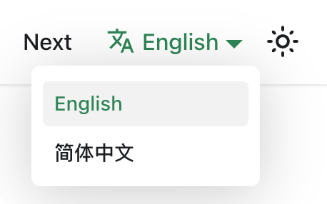

Translation 'docs/ Intr.md' path file is simplified Chinese (zh-Hans).

## Config i18n

Modify `docusaurus.config.js` file, and add `zh-Hans` language config:

```js title="docusaurus.config.js"
export default {
  i18n: {
    # 默认语言
    defaultLocale: 'en',
    # 多语言配置
    locales: ['en', 'zh-Hans'],
  },
};
```

## Translate

```bash npm2yarn
# 推荐使用该命令会统一将 docs blog 等复制到指定语言目录下，并生成相关的侧边栏文件等
yarn write-translations --locale zh-Hans
```

### Translate blog

Here is a separate translation blog operation

```bash npm2yarn
# 创建 i18n/zh-Hans/docusaurus-plugin-content-blog/ 文件夹
mkdir -p i18n/zh-Hans/docusaurus-plugin-content-blog/
# 拷贝 docs/intro.md
cp blog/2024-06-06-docs.md i18n/zh-Hans/docusaurus-plugin-content-blog/2024-06-06-docs.md 
```

### Translate docs

Here is a separate translation docs operation

```bash npm2yarn
# 创建 i18n/zh-Hans/docusaurus-plugin-content-docs/current/ 文件夹
mkdir -p i18n/zh-Hans/docusaurus-plugin-content-docs/current/
# 拷贝 docs/intro.md
cp docs/intro.md i18n/zh-Hans/docusaurus-plugin-content-docs/current/intro.md
```

## Localization preview

```bash npm2yarn
# 中文简体本地化预览
npm run start -- --locale zh-Hans
```

Your localized site is accessible at [http://localhost:3000/fr/](http://localhost:3000/fr/) and the `Getting Started` page is translated.

:::caution

In development, you can only use one locale at a time.

:::

## Add language dropdown list

Modify `docusaurus.config.js` file:

```js title="docusaurus.config.js"
export default {
  themeConfig: {
    navbar: {
      items: [
        // highlight-start
        {
          type: 'localeDropdown',
        },
        // highlight-end
      ],
    },
  },
};
```

The language dropdown list appears in the navigation bar



## Build localized sites

Build your site for a specific locale:

```bash npm2yarn
npm run build -- --locale fr
```

Or build your site to include all the locales at once:

```bash npm2yarn
npm run build
```
