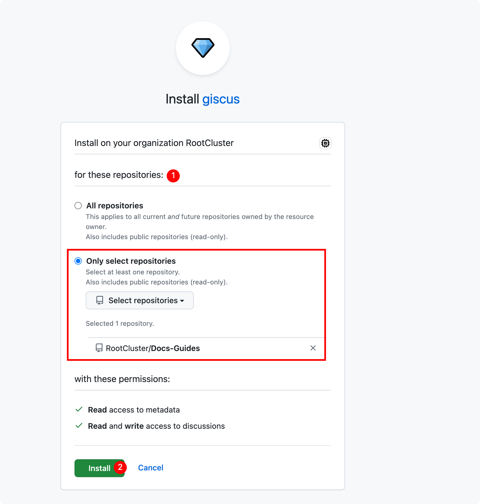
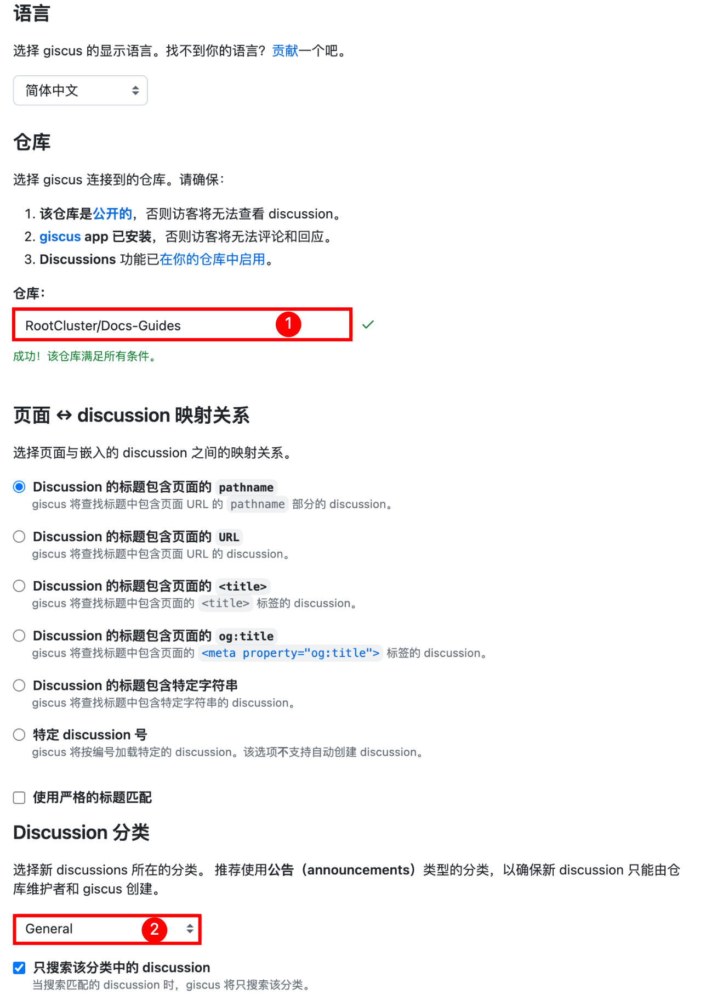

## 添加依赖

```bash npm2yarn
npm install --save @giscus/react
```

## 创建评论组件

```ts title="src/components/Comment.tsx"
import React from 'react'
import { useThemeConfig, useColorMode } from '@docusaurus/theme-common'
import Giscus, { GiscusProps } from '@giscus/react'
import { useLocation } from '@docusaurus/router';

const defaultConfig: Partial<GiscusProps> = {
  id: 'comments',
  mapping: 'specific',
  reactionsEnabled: '1',
  emitMetadata: '0',
  inputPosition: 'top',
  loading: 'lazy',
  // 用根据路径标题自动生成的 sha1 值，精确匹配 github discussion，避免路径重叠（比如父和子路径）时评论加载串了
  strict: '1',
  lang: 'zh-CN',
}

export default function Comment(): JSX.Element {
  const themeConfig = useThemeConfig()

  // merge default config
  const giscus = { ...defaultConfig, ...themeConfig.giscus }

  if (!giscus.repo || !giscus.repoId || !giscus.categoryId) {
    throw new Error(
      'You must provide `repo`, `repoId`, and `categoryId` to `themeConfig.giscus`.',
    )
  }

  const path = useLocation().pathname.replace(/^\/|\/$/g, '');
  const firstSlashIndex = path.indexOf('/');
  var subPath: string = ""
  if (firstSlashIndex !== -1) {
    subPath = path.substring(firstSlashIndex + 1)
  } else {
    subPath = "index"
  }

  giscus.term = subPath
  giscus.theme =
    useColorMode().colorMode === 'dark' ? 'transparent_dark' : 'light'

  return (
    <Giscus {...giscus} />
  )
}
```

## 评论组件加载方式

为了使可配置化开启评论，需要利用 [Swizzling](https://docusaurus.io/docs/swizzling) 的方式调整页面结构，将评论功能嵌入到页面。这里对评论加载的方式进行说明：

- 隐藏评论：通过 eject 方式完全自定义页面以便拿到页面的 metadata 来判断是否需要隐藏评论
- 开启评论：通过 wrap 方式对页面进行轻量修改

为达到开启/隐藏的目的，都需要修改 docs 的页面组件，具有一定的侵入性，但 eject 方式比 wrap 方式的侵入性更大，在升级 docusaurus 的时候，eject 更容易出现兼容性问题，因此本篇文章使用 wrap 的实现方式修改页面组件

### 开启评论

#### docs 页面启用评论

1. swizzle `DocItem`

   ```bash npm2yarn
   npm run swizzle @docusaurus/theme-classic DocItem/Layout -- --wrap --typescript
   ```

2. 修改以下自动生成的源码文件

   ```ts title="src/theme/DocItem/Layout/index.tsx"
    import React from 'react';
    import Layout from '@theme-original/DocItem/Layout';
    import type LayoutType from '@theme/DocItem/Layout';
    import type { WrapperProps } from '@docusaurus/types';
    // highlight-next-line
    import Comment from '@site/src/components/Comment';

    type Props = WrapperProps<typeof LayoutType>;

    export default function LayoutWrapper(props: Props): JSX.Element {
      return (
        <>
          <Layout {...props} />
          // highlight-next-line
          <Comment />
        </>
      );
    }
   ```

#### docs 目录页面启用评论

这里的 docs 目录页面即自动生成的目录页面，是由 docusaurus 的 `DocCategoryGeneratedIndexPage` 渲染

1. swizzle `DocGategoryGeneratedIndexPage`

   ```bash npm2yarn
   npm run swizzle @docusaurus/theme-classic DocCategoryGeneratedIndexPage -- --wrap --typescript
   ```

2. 修改一下生成的源码文件

   ```ts title="src/theme/DocCategoryGeneratedIndexPage/index.tsx"
    import React from 'react';
    import DocCategoryGeneratedIndexPage from '@theme-original/DocCategoryGeneratedIndexPage';
    import type DocCategoryGeneratedIndexPageType from '@theme/DocCategoryGeneratedIndexPage';
    import type { WrapperProps } from '@docusaurus/types';
    // highlight-next-line
    import Comment from '@site/src/components/Comment';

    type Props = WrapperProps<typeof DocCategoryGeneratedIndexPageType>;

    export default function DocCategoryGeneratedIndexPageWrapper(props: Props): JSX.Element {
      return (
        <>
          <DocCategoryGeneratedIndexPage {...props} />
          // highlight-next-line
          <Comment />
        </>
      );
    }
   ```

### 隐藏评论

#### docs 页面隐藏评论

1. swizzle `DocItem`

   ```bash npm2yarn
   npm run swizzle @docusaurus/theme-classic DocItem/Layout -- --eject --typescript
   ```

2. <details>
    <summary>修改一下生成的源码文件: <code>src/theme/DocItem/Layout/index.tsx</code></summary>

    ```ts title="src/theme/DocItem/Layout/index.tsx"
      import React from 'react';
      import clsx from 'clsx';
      import { useWindowSize } from '@docusaurus/theme-common';
      import { useDoc } from '@docusaurus/theme-common/internal';
      import DocItemPaginator from '@theme/DocItem/Paginator';
      import DocVersionBanner from '@theme/DocVersionBanner';
      import DocVersionBadge from '@theme/DocVersionBadge';
      import DocItemFooter from '@theme/DocItem/Footer';
      import DocItemTOCMobile from '@theme/DocItem/TOC/Mobile';
      import DocItemTOCDesktop from '@theme/DocItem/TOC/Desktop';
      import DocItemContent from '@theme/DocItem/Content';
      import DocBreadcrumbs from '@theme/DocBreadcrumbs';
      import Unlisted from '@theme/Unlisted';
      import type { Props } from '@theme/DocItem/Layout';

      import styles from './styles.module.css';
      // highlight-next-line
      import Comment from '../../../components/Comment';

      /**
      * Decide if the toc should be rendered, on mobile or desktop viewports
      */
      function useDocTOC() {
        const { frontMatter, toc } = useDoc();
        const windowSize = useWindowSize();

        const hidden = frontMatter.hide_table_of_contents;
        const canRender = !hidden && toc.length > 0;

        const mobile = canRender ? <DocItemTOCMobile /> : undefined;

        const desktop =
          canRender && (windowSize === 'desktop' || windowSize === 'ssr') ? (
            <DocItemTOCDesktop />
          ) : undefined;

        return {
          hidden,
          mobile,
          desktop,
        };
      }

      export default function DocItemLayout({ children }: Props): JSX.Element {
        const docTOC = useDocTOC();
        // highlight-start
        const { frontMatter } = useDoc();
        const { hide_comment: hideComment } = frontMatter;
        // highlight-end
        const {
          metadata: { unlisted },
        } = useDoc();
        return (
          <div className="row">
            <div className={clsx('col', !docTOC.hidden && styles.docItemCol)}>
              {unlisted && <Unlisted />}
              <DocVersionBanner />
              <div className={styles.docItemContainer}>
                <article>
                  <DocBreadcrumbs />
                  <DocVersionBadge />
                  {docTOC.mobile}
                  <DocItemContent>{children}</DocItemContent>
                  <DocItemFooter />
                </article>
                <DocItemPaginator />
              </div>
              // highlight-next-line
              {!hideComment && <Comment />}
            </div>
            {docTOC.desktop && <div className="col col--3">{docTOC.desktop}</div>}
          </div>
        );
      }
    ```

    </details>

3. 页面配置，对需要隐藏的 docs 页面文章，在 markdown 页面签名加上 `hide_comment: true` 配置

   ```md title="intro.md"
   ---
   hide_comment: true
   ---
   ```

#### 启用页面

- 对于 docs 目录页面：思路和 docs 页面隐藏类似，拿到目录（Category）相关的 metadata，判断 `hide_comment` 的值来处理是否隐藏
- 对于首页：如果需要评论，就固定 import 并在文末使用 `<Comment />` 标签

## 配置 giscus

Giscus 评论数据存储在 GitHub 仓库的 Discussions 中，因此在 GitHub 仓库设置中启用 Discussions 功能

1. 开启 Discussions 功能
2. <details>
    <summary>安装授权 <code>Giscus</code></summary>
   - 打开：https://github.com/apps/giscus
   - 根据自己的需要选择, 这里我只授权指定的仓库

   
    </details>

3. <details>
    <summary>配置仓库和 <code>设置</code></summary>

    

    </details>

4. 根据上一步的配置页面中 `<script>` 内容中得到的配置参数，进行 `docusaurus.config.ts` 配置

    ```ts title="docusaurus.config.ts"
      themeConfig:
        /** @type {import('@docusaurus/preset-classic').ThemeConfig} */
        ({
          // giscus 评论功能
          giscus: {
            repo: '***************',
            repoId: '************',
            category: 'General',
            categoryId: '********************',
          },
        })
    ```

配置完成后，重新启动项目，刷新页面在文章底部就可以看到评论区域了

## 参考

1. [添加 giscus 评论功能](https://imroc.cc/note/docusaurus/giscus)
2. [Swizzle](https://docusaurus.io/zh-CN/docs/swizzling#wrapping)
